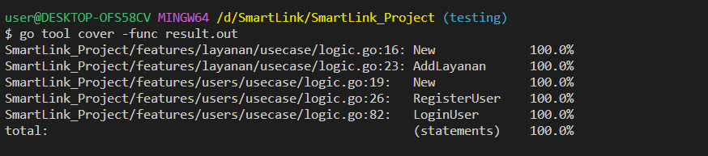

<!-- ABOUT THE PROJECT -->

<h1 align="center">
  SmartLink Project
  <br>
</h1>

<h4 align="center"> SmartLink Project is a Laundry app, users can login, register and add services </h4>
       
## Build App & Database


## ⚙️ Installing and Running from Github

installing and running the app from github repository <br>
To clone and run this application, you'll need [Git](https://git-scm.com) and [Golang](https://go.dev/dl/) installed on your computer. From your command line:

```bash
# Clone this repository
$ git clone https://github.com/vaniliacahya/SmartLink_Project.git

# Go into the repository
$ cd SmartLink_Project

# Run the app
$ go run main.go
```

## Open Api

If you're interested in using our Open Api, this is an example of how to do so.

```bash
https://app.swaggerhub.com/apis-docs/vaniliacahya/SmartLink/1.0.0
```

<div>
      <details>
<summary> Users</summary>
  
  <!---
  | Command | Description |
| --- | --- |
  --->
  
In users, there is a feature to register and login for users
 
<div>
  
| Feature User | Endpoint | Param | JWT Token | Function |
| --- | --- | --- | --- | --- |
| `POST` | /register | - | NO | Feature for users to register their account |
| `POST` | /login | - | NO | Feature for users to login with their registered account |

</details>

<div>
      <details>
<summary> Layanan</summary>
  
  <!---
  | Command | Description |
| --- | --- |
  --->
  
In layanan, there is a feature to add services
 
<div>
  
| Feature Layanan | Endpoint | Param | JWT Token | Function |
| --- | --- | --- | --- | --- |
| `POST` | /layanan | - | YES | Feature for users to add services |

</details>   
   
## Unit Test



## Authors

- Vanilia Cahya Nugroho
       
  Reach me:

  
  [](https://github.com/vaniliacahya)
  [](https://www.linkedin.com/in/vaniliacahya/)
  [](https://api.whatsapp.com/send/?phone=%2B6281249690397&text=Hello&type=phone_number&app_absent=0)

       
 <p align="right">(<a href="#top">back to top</a>)</p>
<h3>
<p align="center">:copyright: 2022 </p>
</h3>
<!-- end -->